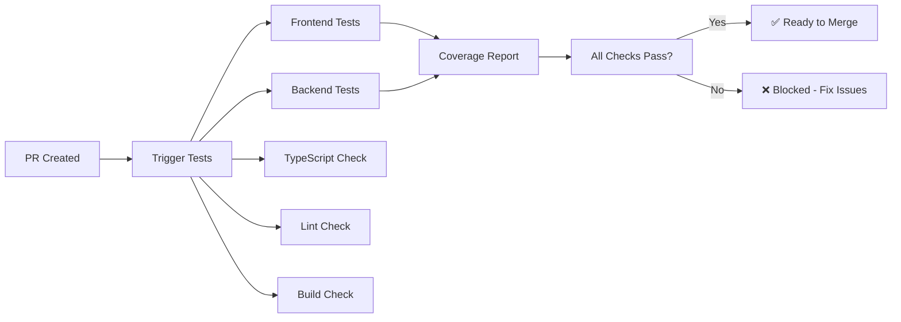

# Branch Protection Setup Guide

This guide walks you through setting up branch protection rules to enforce the CI/CD pipeline and prevent broken code from being merged.

## Required Steps

### 1. Configure Branch Protection Rules

1. Go to your repository on GitHub
2. Navigate to **Settings** → **Branches**
3. Click **"Add branch protection rule"**
4. Configure the following settings:

#### Branch name pattern
```
main
```

#### Protect matching branches
- ✅ **Require a pull request before merging**
  - ✅ Require approvals: `1`
  - ✅ Dismiss stale PR approvals when new commits are pushed
  - ✅ Require review from code owners (if CODEOWNERS file exists)

- ✅ **Require status checks to pass before merging**
  - ✅ Require branches to be up to date before merging
  - **Required status checks to add:**
    - `Frontend Unit Tests`
    - `Backend Unit Tests`
    - `TypeScript Check`
    - `Lint`
    - `Build Check`

- ✅ **Require conversation resolution before merging**
- ✅ **Require signed commits** (optional but recommended)
- ✅ **Include administrators** (applies rules to admins too)

#### Advanced Settings (optional)
- ✅ **Allow force pushes** → ❌ Disable this for security
- ✅ **Allow deletions** → ❌ Disable this for safety

### 2. Verify Required Checks

After setting up branch protection, verify these status checks appear as required:

1. **Frontend Unit Tests** - Tests all React components and hooks
2. **Backend Unit Tests** - Tests all API routes and business logic  
3. **TypeScript Check** - Ensures type safety across the codebase
4. **Lint** - Enforces code style and catches potential issues
5. **Build Check** - Verifies the application builds successfully

### 3. Test the Protection

Create a test PR to verify:

1. ✅ Tests run automatically on PR creation
2. ✅ PR cannot be merged if any test fails
3. ✅ PR shows clear status for each required check
4. ✅ Coverage reports appear in PR comments
5. ✅ Test summary shows overall status

## Troubleshooting

### Status Checks Not Appearing

If required status checks don't appear in the dropdown:

1. Create a PR first to trigger the workflows
2. Wait for workflows to complete (this creates the status checks)
3. Return to branch protection settings
4. The status checks should now be available in the dropdown

### Tests Not Blocking Merge

If tests are failing but PR can still be merged:

1. Verify status checks are properly selected in branch protection
2. Ensure "Require status checks to pass before merging" is enabled
3. Check that the status check names match exactly (case-sensitive)

### Coverage Reports Missing

If coverage reports aren't posted to PRs:

1. Verify the workflows completed successfully
2. Check that artifacts were uploaded properly
3. Ensure the coverage-report job has proper permissions
4. Verify codecov.yml configuration is valid

## Workflow Overview



## Benefits

With branch protection enabled:

- ✅ **Quality Gate**: Broken code cannot be merged
- ✅ **Test Coverage**: Coverage thresholds enforced automatically  
- ✅ **Type Safety**: TypeScript errors caught before merge
- ✅ **Code Style**: Linting issues caught before merge
- ✅ **Build Verification**: Ensures deployable code
- ✅ **Team Visibility**: Clear status in PR interface
- ✅ **Automated Reports**: Coverage and test results in comments

## Required Permissions

The person setting up branch protection needs:

- **Admin access** to the repository
- **Maintain** or higher permissions to modify protection rules

## Related Files

- `.github/workflows/tests.yml` - Main test workflow
- `.github/workflows/test-summary.yml` - PR comment workflow  
- `codecov.yml` - Coverage configuration
- `frontend/vitest.config.ts` - Frontend test configuration
- `backend/vitest.config.ts` - Backend test configuration