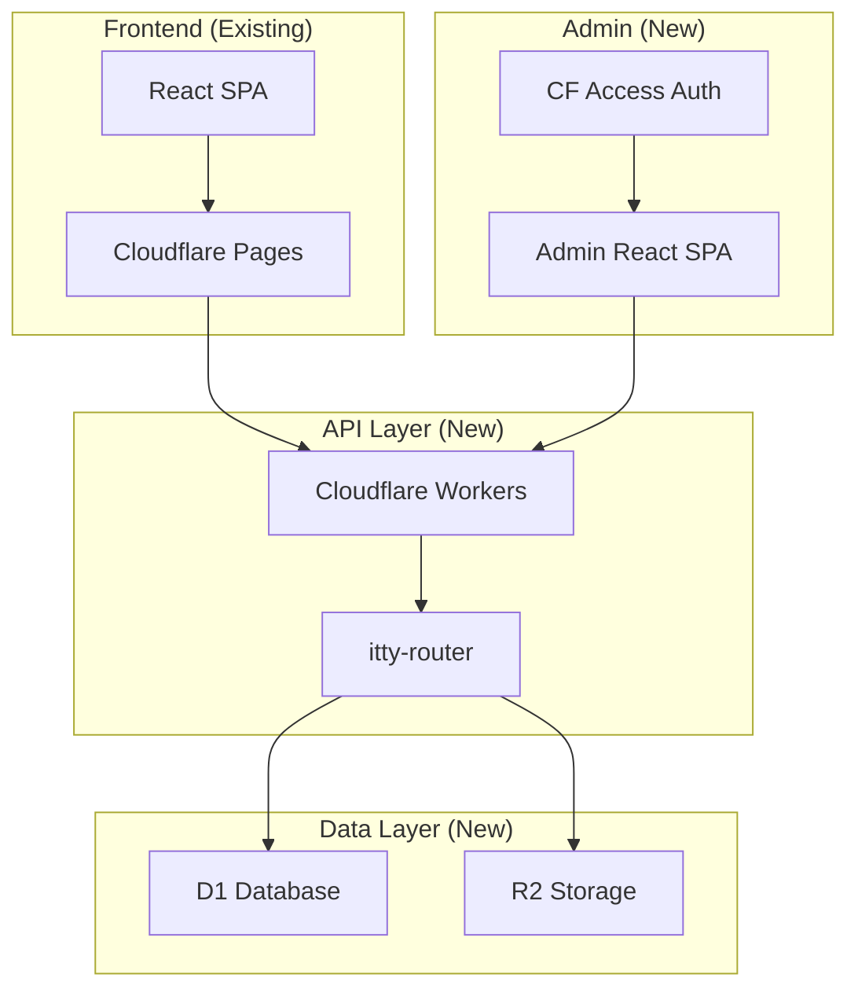

# MatchaMap Backend Implementation PRD

**Version:** 1.0
**Date:** September 30, 2025
**Status:** Draft
**Author:** Engineering Team

## Executive Summary

This PRD outlines the backend implementation strategy for MatchaMap, transitioning from a static JSON-based system to a database-backed architecture using Cloudflare's edge infrastructure.

**Scale:** 2-person startup (1 engineer), small trusted team, prioritizing speed and simplicity over enterprise features. The approach focuses on getting Phase 1 shipped quickly while keeping options open for future growth.

## Goals & Non-Goals

### Goals

-   **Migrate from static JSON to SQL database** with zero downtime
-   **Enable dynamic content management** via admin interface
-   **Support multi-city expansion** (Toronto → Montreal → Tokyo)
-   **Implement scalable data model** with migration support
-   **Maintain sub-100ms response times** globally
-   **Keep infrastructure costs under $5/month** initially

### Non-Goals (Phase 1)

-   User authentication/accounts (localStorage passport continues)
-   E-commerce/payment processing
-   Real-time features (chat, live updates)
-   Native mobile apps
-   Third-party API integrations

## Success Metrics

| Metric                      | Target                           | Current                 |
| --------------------------- | -------------------------------- | ----------------------- |
| Admin Data Update Time      | < 5 min                          | ~30 min (JSON + deploy) |
| Time to deploy              | < 10 min                         | ~30 min                 |
| Time to rollback if broken  | < 5 min                          | N/A                     |
| Monthly Infrastructure Cost | $0                               | $0                      |
| API Response Time           | Fast enough users don't complain | N/A                     |

## Technical Architecture

### Stack Overview



### Technology Choices

| Component     | Technology              | Rationale                      | When to Migrate                                |
| ------------- | ----------------------- | ------------------------------ | ---------------------------------------------- |
| Runtime       | Cloudflare Workers      | Edge performance, $0 free tier | Probably never                                 |
| Database      | Cloudflare D1 (SQLite)  | 5GB free, free tier generous   | When DB > 3GB or slow queries                  |
| Router        | itty-router (450 bytes) | Minimal bundle size            | When you need complex middleware               |
| ORM           | Drizzle ORM             | Type safety + migrations       | Probably never                                 |
| Image Storage | R2                      | $0.015/GB, free egress         | When you need auto-optimization                |
| Cache         | HTTP Cache-Control      | Free, built-in                 | When you have performance issues               |
| Admin Auth    | Cloudflare Access       | Free, your Google account      | Never (or custom when hiring untrusted people) |
| Admin UI      | Custom React SPA        | Full control, same stack       | Probably never (just extend it)                |

**Decision: Use Drizzle ORM** (not just Drizzle Kit) - the type safety is worth the tiny bundle size increase (~5KB) and makes development faster.

## Database Schema

### Phase 1 Schema (MVP)

```sql
-- Core Tables
CREATE TABLE cafes (
    id INTEGER PRIMARY KEY,
    name TEXT NOT NULL,
    slug TEXT UNIQUE NOT NULL,

    -- Location
    link TEXT NOT NULL, -- Google Maps link
    latitude REAL NOT NULL,
    longitude REAL NOT NULL,
    city TEXT NOT NULL, -- toronto, montreal, tokyo (for filtering/navigation only)

    -- Ratings
    score REAL NOT NULL CHECK(score >= 0 AND score <= 10),
    ambiance_score REAL CHECK(ambiance_score >= 0 AND ambiance_score <= 10),
    other_drinks_score REAL CHECK(other_drinks_score >= 0 AND other_drinks_score <= 10),

    -- Pricing
    price REAL, -- Price value (e.g., 7.0)
    charge_for_alt_milk BOOLEAN DEFAULT false,
    grams_used INTEGER, -- Grams of matcha used

    -- Content
    quick_note TEXT NOT NULL,
    review TEXT,

    -- Contact/Social
    hours TEXT, -- JSON object from Google Maps API
    instagram TEXT, -- Handle (e.g., @matchahaven)
    instagram_post_link TEXT, -- Direct post URL
    tiktok_post_link TEXT, -- Direct post URL

    -- Media
    images TEXT, -- Image URLs (likely from Google Maps or uploaded)

    -- Metadata
    created_at TIMESTAMP DEFAULT CURRENT_TIMESTAMP,
    updated_at TIMESTAMP DEFAULT CURRENT_TIMESTAMP,
    deleted_at TIMESTAMP,

    -- Indexes
    INDEX idx_city (city),
    INDEX idx_deleted (deleted_at),
    INDEX idx_slug (slug)
);

CREATE TABLE drinks (
    id INTEGER PRIMARY KEY,
    cafe_id INTEGER NOT NULL REFERENCES cafes(id) ON DELETE CASCADE,

    type TEXT NOT NULL,
    name TEXT NOT NULL,
    price_amount INTEGER NOT NULL,
    price_currency TEXT NOT NULL DEFAULT 'CAD', -- CAD, USD, JPY
    grams_used INTEGER,
    is_default BOOLEAN DEFAULT false,
    notes TEXT,

    created_at TIMESTAMP DEFAULT CURRENT_TIMESTAMP,
    updated_at TIMESTAMP DEFAULT CURRENT_TIMESTAMP,

    INDEX idx_cafe_drinks (cafe_id),
    INDEX idx_default (is_default)
);

CREATE TABLE feed_items (
    id INTEGER PRIMARY KEY,
    type TEXT NOT NULL CHECK(type IN ('new_location', 'score_update', 'announcement', 'menu_update', 'closure')),

    title TEXT NOT NULL,
    preview TEXT NOT NULL,
    content TEXT,

    cafe_id INTEGER REFERENCES cafes(id),
    cafe_name TEXT,

    score REAL,
    previous_score REAL,
    neighborhood TEXT,

    image TEXT,
    author TEXT,
    tags TEXT, -- JSON array

    published BOOLEAN DEFAULT false,
    date TIMESTAMP NOT NULL,
    created_at TIMESTAMP DEFAULT CURRENT_TIMESTAMP,
    updated_at TIMESTAMP DEFAULT CURRENT_TIMESTAMP,

    INDEX idx_published_date (published, date DESC),
    INDEX idx_type (type)
);

CREATE TABLE events (
    id INTEGER PRIMARY KEY,

    title TEXT NOT NULL,
    date DATE NOT NULL,
    time TEXT NOT NULL,

    venue TEXT NOT NULL,
    location TEXT NOT NULL,
    cafe_id INTEGER REFERENCES cafes(id),

    description TEXT NOT NULL,
    image TEXT,
    price TEXT,

    featured BOOLEAN DEFAULT false,
    published BOOLEAN DEFAULT true,

    created_at TIMESTAMP DEFAULT CURRENT_TIMESTAMP,
    updated_at TIMESTAMP DEFAULT CURRENT_TIMESTAMP,

    INDEX idx_date (date),
    INDEX idx_featured (featured)
);

-- Note: No admins table needed - Cloudflare Access handles auth
-- Add audit logging later if you hire untrusted people
```

**Soft Delete Policy:**

-   Items with `deleted_at` are excluded from all public queries
-   Cascade behavior: When cafe is soft-deleted, drinks are also hidden
-   Retention: Keep deleted items indefinitely (storage is cheap)
-   Un-delete: Manually set `deleted_at = NULL` via admin UI if needed

**City as Navigation Concept:**

-   Cities (toronto, montreal, tokyo) are used for filtering and navigation only
-   Not a data division or separation mechanism
-   Neighborhoods removed - city is sufficient for geographic organization

### Phase 3+ Schema (Social Features - Future)

**Note:** Social networking features are intentionally not fully specified here, as product requirements are still being scoped. The following minimal schema ensures the core database design doesn't obstruct future social expansion.

```sql
-- Minimal tables for future social features
CREATE TABLE users (
    id INTEGER PRIMARY KEY,
    email TEXT UNIQUE NOT NULL,
    auth_provider_id TEXT UNIQUE NOT NULL,

    created_at TIMESTAMP DEFAULT CURRENT_TIMESTAMP,
    deleted_at TIMESTAMP
);

-- Sync localStorage passport to backend
CREATE TABLE user_visits (
    id INTEGER PRIMARY KEY,
    user_id INTEGER REFERENCES users(id) ON DELETE CASCADE,
    cafe_id INTEGER REFERENCES cafes(id) ON DELETE CASCADE,
    visited_at TIMESTAMP DEFAULT CURRENT_TIMESTAMP,

    UNIQUE(user_id, cafe_id)
);

-- Placeholder for user-generated content (TBD)
CREATE TABLE user_content (
    id INTEGER PRIMARY KEY,
    user_id INTEGER REFERENCES users(id) ON DELETE CASCADE,
    content_type TEXT NOT NULL, -- 'review', 'photo', 'event', etc.
    content_data TEXT, -- JSON blob, structure TBD
    created_at TIMESTAMP DEFAULT CURRENT_TIMESTAMP,
    deleted_at TIMESTAMP
);
```

**When social features are scoped, add tables for:**

-   User profiles and settings
-   Social graph (follows, friends)
-   User-generated reviews
-   Activity feeds
-   Achievements/gamification
-   User-created events

### Migration Strategy

```bash
# Directory structure
backend/
├── drizzle/
│   ├── schema.ts         # Source of truth
│   ├── migrations/
│   │   ├── 0001_initial_schema.sql
│   │   ├── 0002_add_drinks.sql
│   │   └── meta/_journal.json
│   └── seed.ts          # Import from cafes.json
├── src/
│   ├── index.ts         # Worker entry
│   ├── routes/
│   │   ├── cafes.ts
│   │   ├── feed.ts
│   │   └── admin.ts
│   └── utils/
│       └── db.ts
└── wrangler.toml        # CF config
```

**Migration Commands:**

```bash
# Generate migration from schema changes
npm run db:generate

# Apply to local D1
npm run db:migrate:local

# Apply to production
npm run db:migrate:prod

# Seed from JSON
npm run db:seed
```

## API Specification

### General API Conventions

**Base URL:** `https://api.matchamap.com` (production) | `http://localhost:8787` (local)

**Versioning:** URL-based versioning starting with `/api/v1/` (reserved for breaking changes)

**Response Format:**

All responses are flat JSON objects with no `data` wrapper. Keep it simple.

```typescript
// Success response (200, 201)
{
  "cafes": [...],
  "total": 127
}

// Error response (4xx, 5xx)
{
  "error": "Cafe with ID 123 not found"
}
```

**Standard HTTP Status Codes:**

-   `200 OK` - Success
-   `201 Created` - Resource created
-   `400 Bad Request` - Invalid input
-   `401 Unauthorized` - Missing/invalid auth
-   `403 Forbidden` - Insufficient permissions
-   `404 Not Found` - Resource doesn't exist
-   `422 Unprocessable Entity` - Validation failed
-   `429 Too Many Requests` - Rate limit exceeded
-   `500 Internal Server Error` - Server error

**Rate Limiting:**

Enable Cloudflare's built-in rate limiting in the dashboard: 100 req/min per IP. Don't build custom rate limiting until you have actual abuse.

**CORS:**

-   Allowed origins: `https://matchamap.com`, `https://*.matchamap.com`
-   Allowed methods: `GET, POST, PUT, DELETE, OPTIONS`
-   Credentials: Allowed

**Caching:**

-   Public endpoints: `Cache-Control: public, max-age=300` (5 min)
-   Admin endpoints: `Cache-Control: no-store`
-   ETags supported on GET requests

### Public Endpoints (No Auth)

#### GET /api/health

Health check endpoint for monitoring.

```typescript
// Response (200 OK)
{
  "status": "ok",
  "database": "connected",
  "timestamp": "2025-09-30T12:00:00Z",
  "version": "1.0.0"
}

// Response (503 Service Unavailable) if DB down
{
  "status": "error",
  "database": "disconnected",
  "timestamp": "2025-09-30T12:00:00Z"
}
```

#### GET /api/cafes

Returns list of cafes with optional filtering. **By default, returns all cafes from all cities.**

```typescript
// Query params
interface CafeFilters {
  city?: "toronto" | "montreal" | "tokyo" // Optional - filter by city
  minScore?: number
  maxPrice?: number // Max price value (e.g., 8.0)
  limit?: number // default: 500, max: 500
  offset?: number // for pagination
}

// Response (200 OK) - flat response, no wrapper
{
  "cafes": Cafe[],
  "total": 127,
  "hasMore": true
}

// Error (400 Bad Request)
{
  "error": "Invalid city parameter"
}
```

#### GET /api/cafes/:id

```typescript
// Response (200 OK)
{
  "cafe": Cafe,
  "drinks": DrinkItem[]
}

// Error (404 Not Found)
{
  "error": "Cafe not found"
}
```

#### GET /api/feed

```typescript
// Query params
interface FeedFilters {
  type?: "new_location" | "score_update" | "announcement" | "menu_update" | "closure"
  limit?: number // default: 20
  offset?: number
}

// Response (200 OK)
{
  "items": FeedItem[],
  "hasMore": boolean
}
```

#### GET /api/events

```typescript
// Query params
interface EventFilters {
  upcoming?: boolean // default: true
  featured?: boolean
  limit?: number
}

// Response (200 OK)
{
  "events": EventItem[]
}
```

### Admin Endpoints (CF Access Required)

#### Cafes Management

```
POST   /api/admin/cafes          # Create cafe
PUT    /api/admin/cafes/:id      # Update cafe
DELETE /api/admin/cafes/:id      # Soft delete
POST   /api/admin/cafes/:id/drinks # Add drink
PUT    /api/admin/drinks/:id     # Update drink
DELETE /api/admin/drinks/:id     # Delete drink
```

#### Content Management

```
POST   /api/admin/feed           # Create feed item
PUT    /api/admin/feed/:id       # Update feed item
DELETE /api/admin/feed/:id       # Delete feed item

POST   /api/admin/events         # Create event
PUT    /api/admin/events/:id     # Update event
DELETE /api/admin/events/:id     # Delete event
```

#### Bulk Operations

```
POST   /api/admin/import         # Import from JSON
GET    /api/admin/export         # Export as JSON backup
```

## User Account Migration Strategy (Phase 5+)

**Current (Phase 1-4):** localStorage passport continues working

**When you add user accounts:**

-   Migrate localStorage passport data via API endpoint
-   Users opt-in when creating account
-   No data loss, backwards compatible
-   Details TBD when you scope social features

## Implementation Phases

_Note: Timelines intentionally omitted as they are not accurate at this stage._

### Phase 1: Foundation

-   [ ] Set up Cloudflare Workers project
-   [ ] Configure D1 database
-   [ ] Create initial schema (cafes, drinks, feed, events)
-   [ ] Implement basic CRUD API with error handling
-   [ ] Set up migration pipeline with Drizzle Kit
-   [ ] Configure Cloudflare Access for admin auth
-   [ ] Build basic admin UI (cafe list + create/edit forms)
-   [ ] Implement health check endpoint
-   [ ] Set up monitoring and alerting

**Note:** Neighborhoods removed - city field is sufficient for geographic filtering

**Deliverable:** Backend API with admin interface, data migrated from JSON

### Phase 2: Frontend Integration

-   [ ] Update React app to use API instead of JSON
-   [ ] Add API client with error handling and retries
-   [ ] Implement graceful fallbacks for API failures
-   [ ] Add loading states and skeletons
-   [ ] Cache responses appropriately (5 min TTL)
-   [ ] Deploy parallel to existing site (canary deployment)
-   [ ] localStorage passport continues working
-   [ ] Monitor error rates and performance

**Deliverable:** Live site using database backend, zero disruption to users

### Phase 3: Enhanced Discovery

-   [ ] Map filtering endpoints (price, rating, alt milk, open now)
-   [ ] Quick filter support
-   [ ] Search functionality (cafe name, city)
-   [ ] Image upload to R2 with optimization
-   [ ] Performance optimization (query indexes, caching)
-   [ ] Analytics integration

**Deliverable:** Feature parity + new filtering capabilities

### Phase 4: Multi-City Expansion

-   [ ] Montreal cafe data import
-   [ ] Multi-city routing and URL structure
-   [ ] Review versioning system
-   [ ] Feed automation tools
-   [ ] Analytics dashboard in admin UI
-   [ ] City-specific landing pages

**Deliverable:** Multi-city support with content management workflow

### Phase 5+: Social Features (TBD)

_Social networking features are not fully scoped. This phase will be defined once product requirements are finalized and Phases 1-4 are complete._

**Possible features to consider:**

-   User account creation and authentication
-   localStorage passport → backend sync
-   User profiles
-   Social features (follows, activity feeds)
-   User-generated reviews and photos
-   Achievements and gamification
-   User-created events

## Risk Mitigation

| Risk                       | Impact | Likelihood | Mitigation                                   |
| -------------------------- | ------ | ---------- | -------------------------------------------- |
| Data loss during migration | High   | Low        | Keep JSON backup, test migrations thoroughly |
| API downtime               | High   | Low        | Deploy alongside JSON version first          |
| Cost overrun               | Low    | Low        | Monitor usage, all services have free tiers  |
| Performance regression     | Medium | Medium     | Cache aggressively, monitor P95 latency      |
| Schema changes break app   | High   | Medium     | Versioned API, backwards compatibility       |

## Operational Concerns (Startup Reality Edition)

### Backups

**Using GitHub MCP Server for automated backups:**

Daily GitHub Action (or cron job):
1. Export database: `npm run db:export > backups/cafes-$(date +%Y-%m-%d).json`
2. Use `mcp__github__push_files` to commit and push backup file
   - Commit message: `"Daily backup"`

**If disaster strikes:**
1. Use `mcp__github__get_file_contents` to retrieve previous backup
2. Import: `npm run db:import backups/cafes-2025-09-30.json`

**That's it.** You'll notice if backups break because the GitHub Action will fail.

### Monitoring

**Tools:**

-   Cloudflare Analytics (built-in)
-   UptimeRobot free tier (1 health check → email when down)
-   Your eyeballs (you'll notice if things are slow)

**When something breaks:**

1. User complains or UptimeRobot emails you
2. Check Cloudflare Analytics dashboard
3. Look at recent deployments
4. Rollback if needed (5 min)

**Add Sentry later when:**

-   You're tired of debugging from user complaints
-   You have mystery bugs you can't reproduce

### Deployment

**Using GitHub MCP Server (Recommended):**

Your actual workflow:
1. Use `mcp__github__push_files` to commit and push changes
   - Commit message format: `"Add feature"`
   - Branch: `main`
2. Cloudflare auto-deploys via GitHub integration
3. Check site in browser
4. If broken: use `wrangler rollback` or Cloudflare Dashboard

**Pre-deploy checklist:**

-   [ ] `npm run dev` works locally
-   [ ] Can add/edit cafe in admin UI
-   [ ] Frontend shows data from API
-   [ ] No console errors

Add automated tests when manual testing gets annoying.

### Admin Authentication

**Setup:**

-   Enable Cloudflare Access in dashboard
-   Add your Google account
-   Done

**No roles, no audit logs needed yet.** You trust each other. Add audit logging later if you hire people you don't trust.

### Image Upload (Phase 3+)

When you get here:

1. Generate R2 presigned URL from Worker
2. Upload directly from frontend to R2
3. Save URL to database

Max size: 10MB. Allowed formats: JPEG, PNG, WebP. Figure out resizing later if it becomes a problem.

## Security Considerations

### Phase 1 Security

-   Cloudflare Access for admin endpoints
-   SQL injection prevention via prepared statements
-   CORS configuration for frontend domain only
-   Rate limiting on Workers (10 req/sec default)

### Future Security (Phase 3+)

-   User authentication (Clerk/Auth0)
-   API key management
-   Row-level security for user data
-   GDPR compliance for EU users

## Testing Strategy

**Phase 1: Manual Testing**

Before deploying:

1. Does `npm run dev` work?
2. Can you create/edit a cafe in admin UI?
3. Does the frontend show cafes from the API?
4. No console errors?

Ship it.

**Add automated tests later when:**

-   Manual testing becomes annoying (probably Phase 3)
-   You have bugs that keep coming back
-   You want to refactor with confidence

**Load testing:** You don't have traffic yet. Worry about this when you have 1000+ daily users.

## Cost Analysis

### Phase 1-4: Your Actual Costs

| Service         | Your Usage | Cost         |
| --------------- | ---------- | ------------ |
| Workers         | < 100k/day | $0           |
| D1 Database     | < 1GB      | $0           |
| R2 Storage      | < 1GB      | $0           |
| Everything else | Free tier  | $0           |
| **Total**       |            | **$0/month** |

You won't pay anything until you have real traffic. Stop worrying about costs.

### When You Actually Grow

**If you get to 1,000 users:** ~$25-40/month (mostly auth provider)
**If you get to 10,000 users:** ~$300/month

At that point, you'll have revenue or funding and can worry about optimization. Don't optimize for scale you don't have.

**When to migrate off D1:**

-   Database > 3GB
-   Queries consistently slow (>200ms)
-   Complex social features need better join performance

Drizzle ORM makes migrating to PostgreSQL straightforward when you get there.

## Success Criteria

### Launch Criteria (Phase 1)

-   [ ] Can create/edit cafes in admin UI
-   [ ] Frontend shows cafes from API
-   [ ] Users don't complain it's slow
-   [ ] Can rollback if needed
-   [ ] Cheaper/faster than JSON deploy workflow

That's it. Don't overthink it.

## Appendices

### A. Sample Worker Code

```typescript
// src/index.ts
import { Router } from "itty-router";

const router = Router();

// Public routes
router.get("/api/cafes", async (request, env) => {
    const { searchParams } = new URL(request.url);
    const city = searchParams.get("city") || "toronto";

    const { results } = await env.DB.prepare(
        "SELECT * FROM cafes WHERE city = ? AND deleted_at IS NULL"
    )
        .bind(city)
        .all();

    return new Response(JSON.stringify({ cafes: results }), {
        headers: {
            "content-type": "application/json",
            "cache-control": "public, max-age=300", // 5 min cache
        },
    });
});

// Admin routes (CF Access protects these)
router.post("/api/admin/cafes", async (request, env) => {
    const cafe = await request.json();

    const result = await env.DB.prepare(
        "INSERT INTO cafes (name, slug, link, latitude, longitude, city, score, quick_note) VALUES (?, ?, ?, ?, ?, ?, ?, ?)"
    )
        .bind(cafe.name, cafe.slug, cafe.link, cafe.latitude, cafe.longitude, cafe.city, cafe.score, cafe.quick_note)
        .run();

    return new Response(JSON.stringify({ id: result.meta.last_row_id }), {
        headers: { "content-type": "application/json" },
    });
});

export default {
    fetch: router.handle,
};
```

### B. Migration Example

```sql
-- drizzle/migrations/0003_add_review_versioning.sql
ALTER TABLE cafes ADD COLUMN current_review_version INTEGER DEFAULT 1;

CREATE TABLE review_versions (
    id INTEGER PRIMARY KEY,
    cafe_id INTEGER NOT NULL REFERENCES cafes(id),
    version INTEGER NOT NULL,
    review TEXT,
    score REAL,
    created_at TIMESTAMP DEFAULT CURRENT_TIMESTAMP,

    UNIQUE(cafe_id, version)
);

-- Migrate existing reviews
INSERT INTO review_versions (cafe_id, version, review, score)
SELECT id, 1, review, score FROM cafes WHERE review IS NOT NULL;
```

### C. Rollback Plan

1. **API Rollback**

    ```bash
    # Point frontend back to JSON
    npm run deploy:use-json
    ```

2. **Database Rollback**

    ```bash
    # Rollback migration
    npm run db:rollback

    # Export current data
    npm run db:export > backup.json
    ```

3. **Full Rollback**
    - DNS: Point to old Cloudflare Pages deployment
    - Workers: Disable routes in dashboard
    - Time to rollback: <5 minutes

### D. TypeScript Types

**Note:** Full type definitions should mirror your database schema. See [src/types/index.ts](../src/types/index.ts) for complete types.

```typescript
// Core types matching database schema
interface Cafe {
    id: number;
    name: string;
    slug: string;

    // Location
    link: string; // Google Maps URL
    latitude: number;
    longitude: number;
    city: "toronto" | "montreal" | "tokyo";

    // Ratings
    score: number;
    ambiance_score?: number;
    other_drinks_score?: number;

    // Pricing
    price?: number;
    charge_for_alt_milk: boolean;
    grams_used?: number;

    // Content
    quick_note: string;
    review?: string;

    // Contact/Social
    hours?: string; // JSON from Google Maps
    instagram?: string;
    instagram_post_link?: string;
    tiktok_post_link?: string;

    // Media
    images?: string;

    // Metadata
    created_at: string;
    updated_at: string;
    deleted_at?: string;
}

interface DrinkItem {
    id: number;
    cafe_id: number;
    type: string;
    name: string;
    price_amount: number;
    price_currency: "CAD" | "USD" | "JPY";
    grams_used?: number;
    is_default: boolean;
    notes?: string;
}

interface FeedItem {
    id: number;
    type:
        | "new_location"
        | "score_update"
        | "announcement"
        | "menu_update"
        | "closure";
    title: string;
    preview: string;
    content?: string;
    cafe_id?: number;
    published: boolean;
    date: string;
}

interface EventItem {
    id: number;
    title: string;
    date: string;
    time: string;
    venue: string;
    location: string;
    description: string;
    featured: boolean;
    published: boolean;
}
```

---

\*\*

## Summary

### This PRD is designed for a 2-person startup that wants to ship fast

**What's decided:**

-   ✅ Cloudflare Workers + D1 + Drizzle ORM
-   ✅ Simple REST API with consistent response format
-   ✅ Custom React admin UI (same stack as main app)
-   ✅ Daily GitHub backups
-   ✅ Manual testing until it's annoying
-   ✅ Minimal monitoring (CF Analytics + UptimeRobot)

**What's intentionally NOT decided:**

-   Social features (not scoped yet, minimal schema reserved)
-   Complex monitoring/alerting (add when needed)
-   Automated testing (add when manual gets annoying)
-   Audit logging (add when you hire untrusted people)

**What you should do next:**

1. Set up Cloudflare Workers project (30 min)
2. Create D1 database with Drizzle (1 hour)
3. Build basic cafe CRUD API (3 hours)
4. Build admin UI (cafe list + forms) (4 hours)
5. Connect frontend to API (2 hours)
6. Ship it

**Total time to Phase 1: ~2 days of focused work**

Ship Phase 1, validate with real users, then decide what to build next.

---

**Document Status:** Ready to Ship

**Next Steps:** Stop reviewing, start building Phase 1
